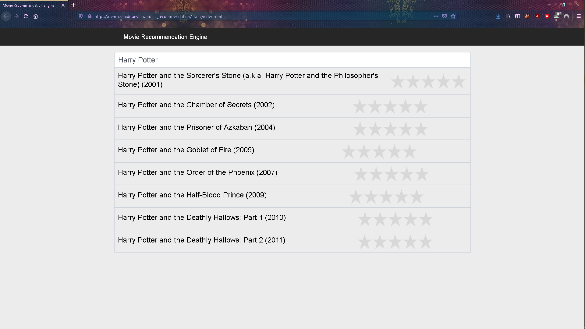
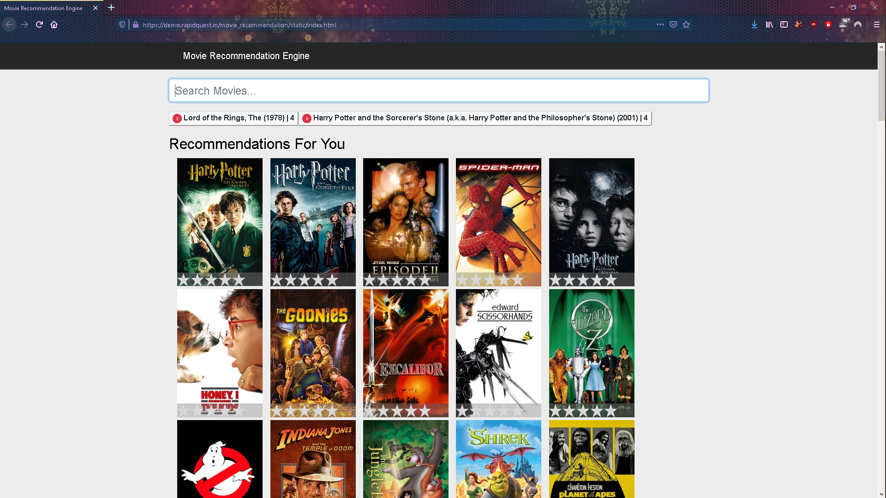
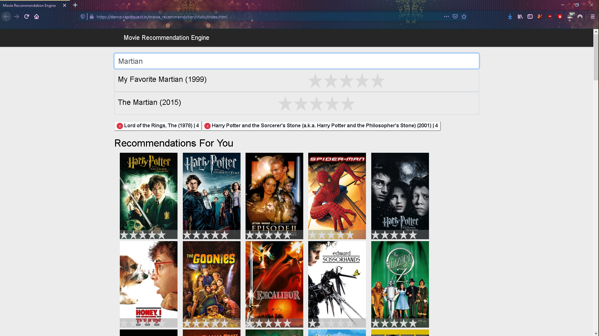
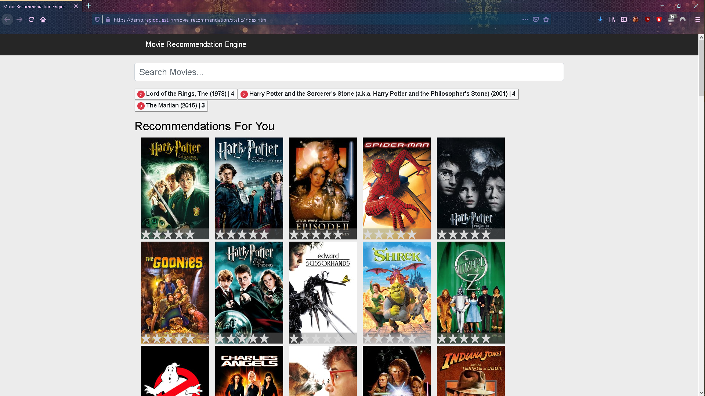

## Movie Recommendation :desktop_computer: Tool Using Machine Learning ##

	Aim:- To predict similar movies and recommend top 50 similar movies to the user.#

Uses sklearn library 
Uses 2 features of sklearn 
 1. countVectorizer -class 
 2. cosine_similarity() -method
	
Dataset of  _4000+ movies_. 
 

##### :point_down: Below are the ScreenShots of a Web Application based on this Model
	
	

> **Web Application**  
  App Link: https://demo.rapidquest.in/movie_recommendation/static/index.html \
  Project Link: https://github.com/codeheroku/Introduction-to-Machine-Learning/tree/master/Building%20a%20Movie%20Recommendation%20Engine

Credit: **_Mihir Thakkar(Code Heroku)_**
